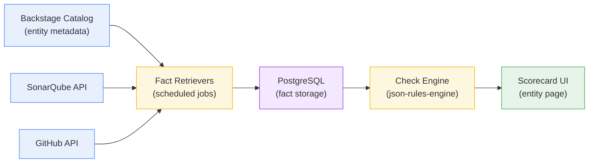

# Scorecards — Review & Validation

> **Purpose:** Present the Scorecards (Tech Insights) implementation currently deployed in the Developer Portal, explain how it works, and gather your feedback on the checks and governance model.

---

## Table of Contents

1. [What Are Scorecards?](#what-are-scorecards)
2. [How It Works](#how-it-works)
3. [Scorecard Groups & Checks](#scorecard-groups--checks)
4. [How Teams Fix Failing Checks](#how-teams-fix-failing-checks)
5. [Annotations Required Per Tier](#annotations-required-per-tier)
6. [Feedback](#feedback)

---

## What Are Scorecards?

Scorecards provide **automated, continuous governance** across every service in the Developer Portal. Instead of relying on manual audits to verify whether services have the right metadata, documentation, and security settings, the portal evaluates them automatically on a recurring schedule.

Each service is measured against a defined set of **checks** — pass/fail rules that verify things like:

- Does this service have an owner?
- Is it connected to SonarQube for code quality analysis?
- Is there an operational runbook for on-call situations?
- Are GitHub Advanced Security features enabled on the repository?

Results are displayed directly on each service's page in the portal, organized into four themed groups. The screenshot below shows a service with all four scorecard panels.

<!-- TODO: Replace with current screenshot -->


---

## How It Works

Scorecards are powered by Backstage's **Tech Insights** framework. The system operates in three layers:

| Layer | What It Does | Example |
|-------|-------------|---------|
| **Fact Retrievers** | Periodically collect data about each service from various sources (catalog metadata, SonarQube, GitHub) | "Does this service have a `spec.owner` field?" → `true` |
| **Checks** | Evaluate facts against rules and produce a pass/fail result | "Has Owner: owner must be set" → ✅ Pass |
| **Scorecards** | Group related checks into themed panels on the service page | "Catalog Completeness" panel showing 6 checks |

### Architecture



**Key points:**

- **Scheduled:** Fact retrievers run automatically — every 15 minutes for catalog-based checks, hourly for TechDocs, and every 30 minutes for GitHub security checks.
- **Persistent:** Facts are stored in PostgreSQL with a configurable retention period (currently 2 weeks).
- **Hands-off:** Once configured, the system requires no manual intervention. Scores update as services evolve.
- **Read-only:** Scorecards never create, modify, or delete data in any external system (SonarQube, GitHub, etc.).

---

## Scorecard Groups & Checks

All 18 checks are organized into **4 groups**, each displayed as a separate panel on the service page. The groups progress from foundational catalog hygiene through to security compliance.

### Tier 1 — Catalog Completeness

> Core catalog fields every service must have for discoverability and governance.

| # | Check | What It Verifies | Data Source |
|---|-------|-----------------|-------------|
| 1 | **Has Owner** | `spec.owner` is set on the entity | Catalog metadata |
| 2 | **Has Group Owner** | Owner is a team (Group), not an individual user | Catalog metadata |
| 3 | **Has Description** | `metadata.description` is non-empty | Catalog metadata |
| 4 | **Has Tags** | At least one tag in `metadata.tags` | Catalog metadata |
| 5 | **Part of a System** | `spec.system` points to a registered system | Catalog metadata |
| 6 | **Has Lifecycle** | `spec.lifecycle` is set (e.g., production, experimental) | Catalog metadata |

**Why it matters:** These fields are the foundation of service discoverability. Without them, services cannot be found, owners cannot be reached during incidents, and system dependencies cannot be mapped.

### Tier 2 — Developer Readiness

> Documentation, operational runbooks, and production-readiness annotations.

| # | Check | What It Verifies | Data Source |
|---|-------|-----------------|-------------|
| 7 | **TechDocs Configured** | `backstage.io/techdocs-ref` annotation is present | Catalog metadata |
| 8 | **Has Runbook URL** | Runbook annotation is present, linking to an operational runbook | Catalog metadata |
| 9 | **Has On-Call Service** | On-call service annotation is present for incident routing | Catalog metadata |
| 10 | **Has Data Classification** | Data classification annotation is set (restricted, internal, or public) | Catalog metadata |

**Why it matters:** These are the fields that matter during an incident. Can the on-call engineer find the documentation? Is there a runbook? Who should be contacted? What sensitivity level does this service's data carry?

### Tier 3 — Code Quality

> SonarQube integration and quality gate compliance.

| # | Check | What It Verifies | Data Source |
|---|-------|-----------------|-------------|
| 11 | **SonarQube Project Registered** | `sonarqube.org/project-key` annotation is present | SonarQube API |
| 12 | **SonarQube Gate Passed** | The SonarQube quality gate status is `OK` | SonarQube API |

**Why it matters:** Quality gates provide an automated checkpoint for code quality. A failing gate indicates unresolved bugs, security vulnerabilities, or insufficient test coverage in the codebase.

### Tier 4 — Security Posture

> GitHub Advanced Security — code scanning, secret scanning, and Dependabot.

| # | Check | What It Verifies | Data Source |
|---|-------|-----------------|-------------|
| 13 | **Code Scanning Enabled** | GitHub CodeQL code scanning is active on the repository | GitHub API |
| 14 | **No Open Code Scanning Alerts** | Zero unresolved code scanning alerts | GitHub API |
| 15 | **Secret Scanning Enabled** | GitHub secret scanning is active on the repository | GitHub API |
| 16 | **No Open Secret Scanning Alerts** | Zero unresolved secret scanning alerts | GitHub API |
| 17 | **Dependabot Enabled** | Dependabot alerts are active on the repository | GitHub API |
| 18 | **No Open Dependabot Alerts** | Zero unresolved Dependabot alerts | GitHub API |

**Why it matters:** Enabling security features is only the first step. These checks verify that teams are both using GitHub's security tooling **and** actively resolving the findings it surfaces.

---

## How Teams Fix Failing Checks

Every failing check displays an inline **solution message** explaining exactly what needs to change. Teams see the fix directly below the failed check — no guesswork required.

<!-- TODO: Replace with current screenshot showing a failing check with solution text -->


Below are representative examples of the guidance provided for common failures:

| Failed Check | Solution Message |
|---|---|
| Has Owner | Add `spec.owner` to your `catalog-info.yaml` referencing a Group from the teams catalog. |
| Has Group Owner | Change `spec.owner` to reference a Group (e.g., `group:default/my-team`), not a User. |
| TechDocs Configured | Add `backstage.io/techdocs-ref` annotation pointing to your docs directory. |
| SonarQube Project Registered | Add `sonarqube.org/project-key` annotation with your SonarQube project key. |
| Code Scanning Enabled | Enable Code Scanning (CodeQL) under repository Settings → Code security and analysis. |

The goal is to ensure that every failing check is **actionable**. A team should never see a failure without a clear path to resolution.

---

## Annotations Required Per Tier

Services are enriched by adding annotations to their `catalog-info.yaml` file. Below is what each tier requires:

### Tier 1 — No additional annotations needed

Tier 1 checks use standard Backstage catalog fields (`spec.owner`, `spec.system`, `spec.lifecycle`, `metadata.description`, `metadata.tags`). These are part of the base catalog schema and require no extra annotations.

### Tier 2 — Custom annotations

```yaml
metadata:
  annotations:
    backstage.io/techdocs-ref: "dir:."
    <your-org>.io/runbook-url: "https://runbooks.example.com/<service-name>"
    <your-org>.io/oncall-service: "<service-oncall-key>"
    <your-org>.io/data-classification: "restricted | internal | public"
```

### Tier 3 — SonarQube annotation

```yaml
metadata:
  annotations:
    sonarqube.org/project-key: "<sonarqube-project-key>"
```

### Tier 4 — GitHub annotation

```yaml
metadata:
  annotations:
    github.com/project-slug: "<org>/<repo-name>"
```

> Annotations are added at each team's own pace. Until a service includes the required annotations, the corresponding checks will show as failing. This is by design — it creates visibility and provides a clear incentive to improve catalog quality.

---

## Feedback

This document is intended as a reference for the scorecard implementation currently deployed in the Developer Portal. We welcome any feedback — whether it's about the checks themselves, the grouping, the solution guidance, or how scorecards should fit into your broader engineering processes.

Please share your thoughts via email, in a call, or as comments on this document.
